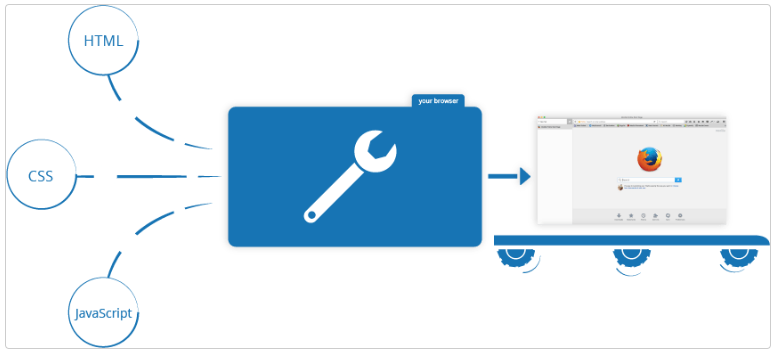

## AULA 9

<br />

- Disciplina: Programação Web
- Professor: Eduardo Malherbi Martins

---

O que é Javascript?

---

#### JavaScript

- JavaScript é uma linguagem de programação que permite a você implementar itens complexos em páginas web — toda vez que uma página da web faz mais do que simplesmente mostrar a você informação estática — mostrando conteúdo que se atualiza em um intervalo de tempo, mapas interativos ou gráficos 2D/3D animados, etc.

---

#### Web

- HTML é a linguagem de marcação que nós usamos para estruturar e dar significado para o nosso conteúdo web.
  - Por exemplo, definindo parágrafos, cabeçalhos, tabelas de conteúdo, ou inserindo imagens e vídeos na página.

---

#### Web

- CSS é uma linguagem de regras de estilo que nós usamos para aplicar estilo ao nosso conteúdo HTML.
  - Por exemplo, definindo cores de fundo e fontes, e posicionando nosso conteúdo em múltiplas colunas.

---

#### Web

- JavaScript é uma linguagem de programação que permite a você criar conteúdo que se atualiza dinamicamente, controlar múltimídias, imagens animadas, etc...

---

#### Exemplo

```js
<p>Informe seu nome:</p>

<script>
const para = document.querySelector('p');

para.addEventListener('click', atualizarNome);

function atualizarNome() {
  var nome = prompt('Insira um novo nome');
  para.textContent = 'Jogador 1: ' + nome;
}
</script>
```

---

#### Então o que ele pode realmente fazer?

- Armazenar conteúdo útil em variáveis.
  - No exemplo, nós pedimos que um novo nome seja inserido e armazenamos o nome em uma variável chamada nome.

---

#### Então o que ele pode realmente fazer?

- Operações com pedaços de texto (conhecidos como "strings" em programação).
  - No exemplo, nós pegamos a string "Jogador 1: " e concatenamos com a variável nome para criar o texto completo "Jogador 1: Juca Bala".

---

#### Então o que ele pode realmente fazer?

- Executar o código em resposta a determinados eventos que ocorrem em uma página da Web.
  - Nós usamos o click no nosso exemplo para que quando clicassem no botão, rodasse o código que atualiza o texto.

---

#### Browser APIs

- APIs de navegadores já vem implementadas no navegador, e são capazes de expor dados do ambiente do computador, ou fazer coisas complexas e úteis.

---

#### Browser APIs

- A API DOM (Document Object Model) permite a você manipular HTML e CSS, criando, removendo e mudando HTML, aplicando dinamicamente novos estilos para a sua página, etc. Toda vez que você vê uma janela pop-up aparecer em uma página, ou vê algum novo conteúdo sendo exibido (como nós vimos no exemplo), isso é o DOM em ação.

---

#### Browser APIs

- A API de Geolocalização recupera informações geográficas. É assim que o Google Maps consegue encontrar sua localização e colocar em um mapa.

---

#### Browser APIs

- As APIs Canvas e WebGL permite a você criar gráficos 2D e 3D animados.
  - [Chrome Experiments](https://experiments.withgoogle.com/search?q=WebGL)
  - [webglsamples](https://webglsamples.org/).

---

#### Browser APIs

- APIs de áudio e vídeo como HTMLMediaElement (en-US) e WebRTC permitem a você fazer coisas realmente interessantes com multimídia, tanto tocar música e vídeo em uma página da web, como capturar vídeos com a sua câmera e exibir no computador de outra pessoa.

---

#### O que JavaScript está fazendo na sua página web?

- Quando você carrega uma página web no seu navegador, você está executando seu código (o HTML, CSS e JavaScript) dentro de um ambiente de execução (a guia do navegador).
- Isso é como uma fábrica que pega a matéria prima (o código) e transforma em um produto (a página web).

---

#### O que JavaScript está fazendo na sua página web?



---

#### O que JavaScript está fazendo na sua página web?

- Um uso muito comum do JavaScript é modificar dinamicamente HTML e CSS para atualizar uma interface do usuário, por meio da API do DOM.
- Observe que o código em seus documentos web geralmente é carregado e executado na ordem em que aparece na página. Se o JavaScript carregar e tentar executar antes do carregamento do HTML e CSS afetado, poderão ocorrer erros.

---

#### Aula Prática

---

#### Tipo de dados

- Ref: 06 - Escreva um programa que obtêm dois valores inteiros (variáveis A e B) e apresente as operações de adição, subtração, multiplicação e divisão de A por B.

---

#### Tipo de dados

- Ref: 17 - Ler o preço de um produto e calcular o novo preço com desconto informado.

---

#### Tipo de dados

- Ref: 26 - Efetuar a leitura de um número inteiro e apresentar a tabuada deste número.

---

#### Condição IF

- Ref: 16 - Elabore um programa que, dada a idade de um nadador, classifique-o em uma das seguintes categorias:
  - infantil A = 5 - 7 anos
  - infantil B = 8 - 11 anos
  - juvenil A = 12 - 14 anos
  - juvenil B = 15 - 18 anos
  - sênior = maiores de 18 anos

---

#### Condição IF

- Ref: 31 - O Índice de Massa Corporal (IMC) é uma fórmula que indica se um adulto está acima do peso, se está obeso ou abaixo do peso ideal considerado saudável. A fórmula para calcular o Índice de Massa Corporal é: IMC = peso / (altura)2. A Organização Mundial de Saúde usa um critério simples para considerar quem está acima do peso e quem é obeso:
  - IMC calculado = Situação
  - Menos de 20 = Abaixo do peso
  - 20 ≤ IMC < 25 = Peso Normal
  - 25 ≤ IMC < 30 = Acima do peso
  - 30 ≤ IMC < 34 = Obeso
  - Acima de 34 = Muito Obeso

---

### Lista Array

- Ref: 02 - Criar um vetor A com 8 elementos inteiros igual: 5, 6, 7, 10, 13, 15, 18, 20. Construir um vetor B de mesmo tipo e tamanho e com os elementos do vetor A multiplicados por 2.

---

### Lista Str

- Ref 06: Fazer um programa para contar quantos espaços em branco existem em uma frase fornecida pelo usuário.

---

### Jogo adivinhe o número

- Nós selecionamos um número aleatório entre 1 e 100. Veja se consegue adivinhar em 10 chances ou menos. Nós lhe diremos se seu palpite foi muito alto ou muito baixo.

---

#### Referências

- [Javascript](https://developer.mozilla.org/en-US/docs/Learn/JavaScript/First_steps/What_is_JavaScript)
