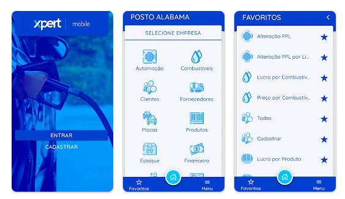

#### Sobre o professor

Olá! Sou Eduardo Malherbi Martins.

 

- Desenvolvedor de software a mais de 14 anos com foco no desenvolvimento WEB;
- Coordenador Web e Scrum Master na XPert;

---

#### Contato

---

#### Projetos

---

#### Projetos

---

#### Projetos

---

#### Conhecimentos

- WEB development: Docker. HTML. XHTML. CSS. CSS3. SASS. LESS. JavaScript. JQuery. AngularJS. Angular. Bootstrap. PureCSS. Flash Builder 4. PHP. ZEND. Wordpress. Grav. Java. NodeJS. NestJS. TypeORM.
- Desktop development: Object Pascal (Delphi7, Delphi2007, Delphi2010). Visual Basic. Java.

---

#### Conhecimentos

- Mobile development: Ionic. PhoneGap. Android (Java). JQueryMobile.
- Servers: Azure (Microsoft). AWS (Amazon). Apache. Nginx.
- Creating Reports: FPDF. DOMPDF. FastReport. QuickReport.
- Electronic Tax Invoice: NFePHP.

---

#### Conhecimentos

- Mainframe programming: COBOL (Bath, IMS e Stored Procedures), Micro Focus MainFrame (MFE).
- SGBD: Sql Server 2000, 2005, 2008, 2012. DB2. MySql. MongoDB.
- Creating Test Cases and Test Software: MERCURY QUALITY CENTER. HexaVison (HSBC).
