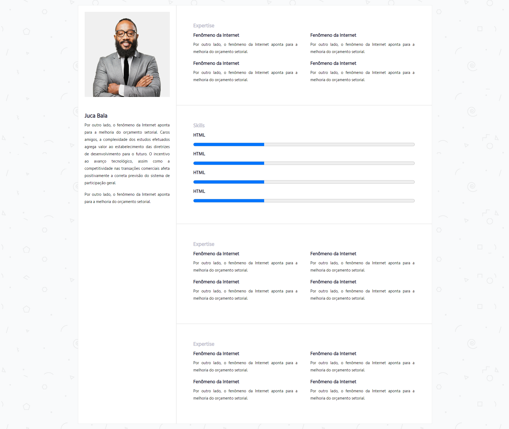
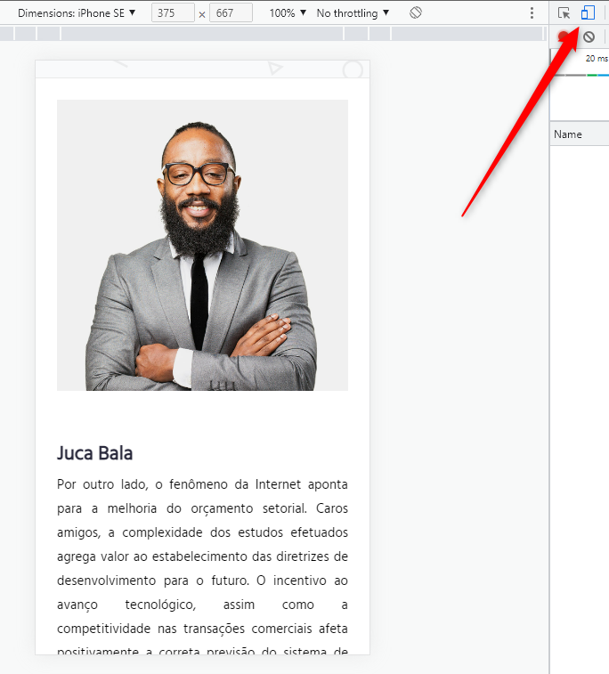
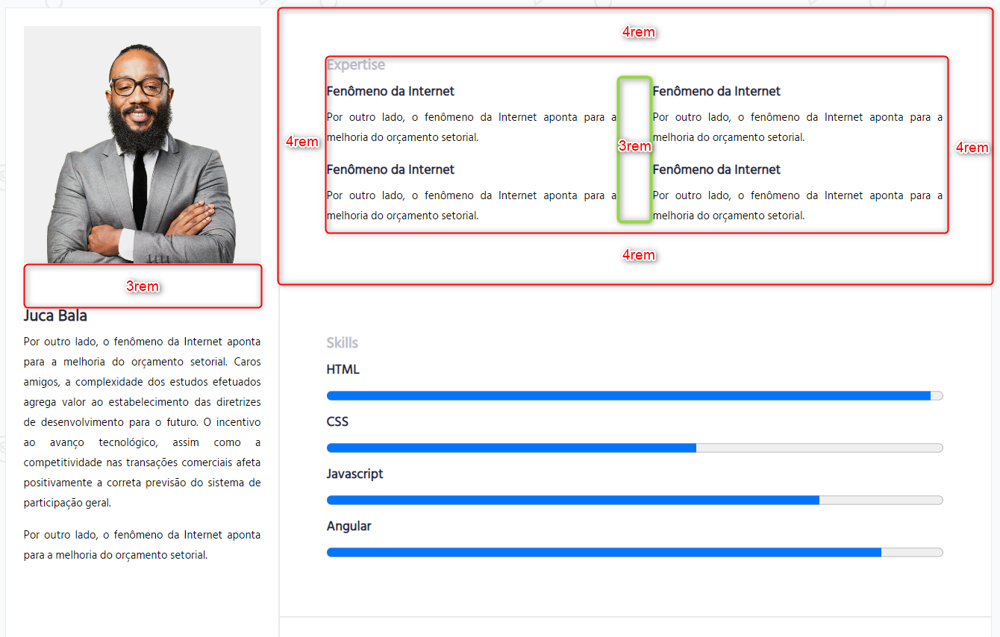
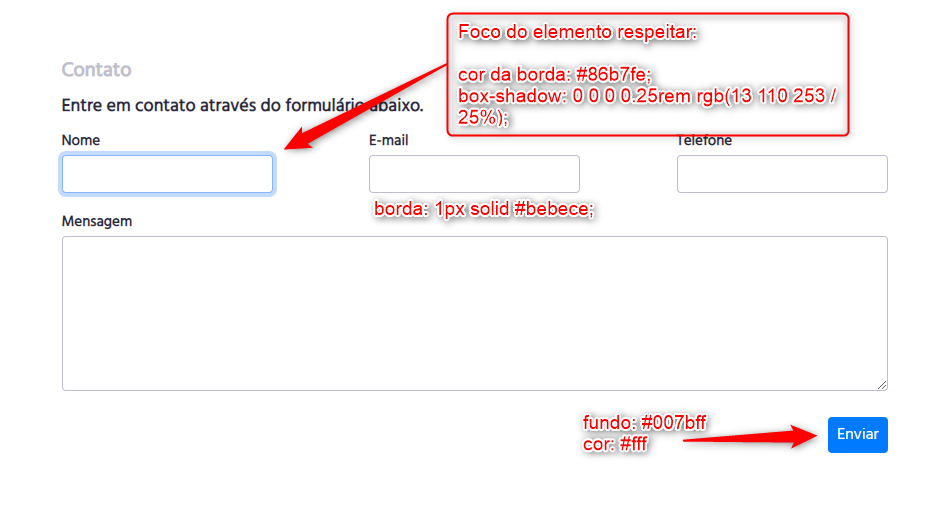
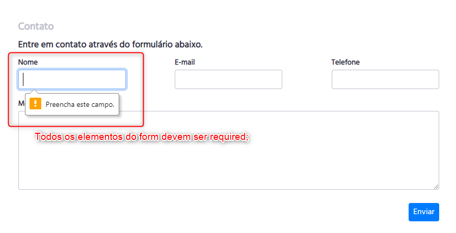

## Desafio Currículo

---

Clique sobre a imagem para vizualizar.

[](img/cv.png)

---

#### Regras do Trabalho

1. Desenvolver o currículo conforme layout utilizando HTML e CSS apreendidos em sala de aula;
2. <b>Atenção</b>: Não é permitido utilizar nenhum framework CSS ou javascript que altere o CSS;

---

#### Regras do Trabalho

3. O Site deve ser responsivo para dispositivo móveis;

```css
@media only screen and (max-width: 480px) {
  h1 {
    color: red; /* Exemplo */
  }
}
```

---

#### Regras do Trabalho

4. Para testar CTRL + SHIFT + I no google chrome, segue imagem de exemplo;

---

Clique sobre a imagem para vizualizar.

[](img/cv-mobile.png)

---

#### Regras do Trabalho

5. Espaçamentos seguir conforme imagem de exemplo;
6. Todas as sections devem ter o mesmo espaçamento;

---

Clique sobre a imagem para vizualizar.

[](img/cv-espacamentos.png)

---

#### Regras do Trabalho

7. Contato seguir conforme imagem de exemplo;

---

Clique sobre a imagem para vizualizar.

[](img/cv-contato.png)

---

#### Regras do Trabalho

8. Contato seguir conforme imagem de exemplo;

---

Clique sobre a imagem para vizualizar.

## [](img/cv-contato-required.png)

---

#### Regras do Trabalho

9. Efetuar o cadastro do site [formspree](https://formspree.io/);
10. Fazer uma das implementações para envio de e-mail do seu formulário;

---

#### Regras do Trabalho

11. O código deve ser formatado, pode-se utilizar [prettier](https://prettier.io/)

---

Entrega: 29/08/2022, até 22:40;

---

## Aula prática
