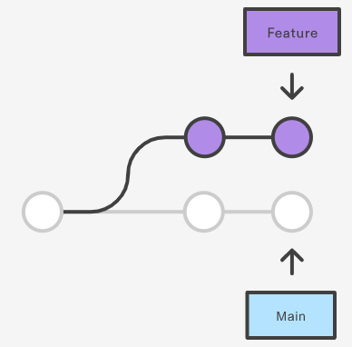
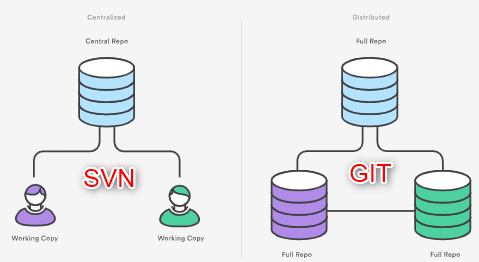
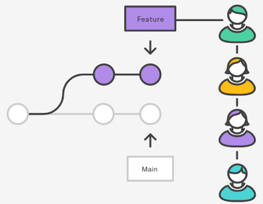
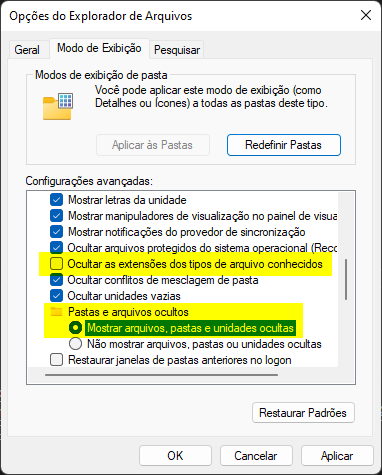
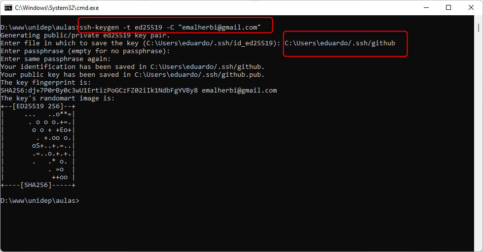
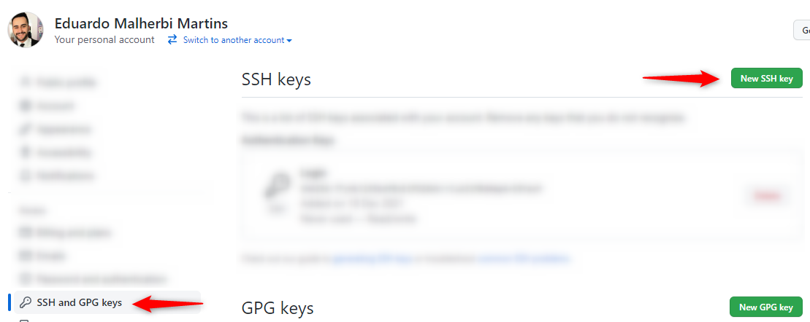
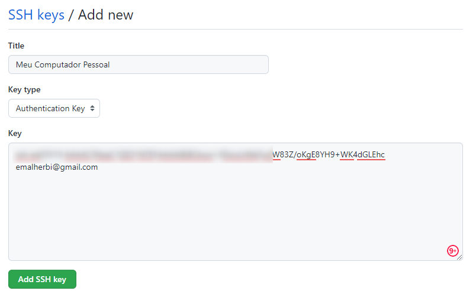

## AULA 7

<br />

- Disciplina: Programação Web
- Professor: Eduardo Malherbi Martins

---

O que é GIT?

---

#### GIT

DVCS - Distributed Version Control Systems ou <b>Sistema de Controle de Versão Distribuído</b>.

---

#### Exemplos

- [SVN](https://tortoisesvn.net/)
- [GIT](https://git-scm.com/)
- [BitKeeper](http://www.bitkeeper.org/)
- [Mercurial](https://www.mercurial-scm.org/)

---

#### Uma Breve História do Git

<br />
O núcleo (kernel) do Linux é um projeto de código aberto com um escopo bastante grande.
<br /><br />
Em 2002, o projeto do núcleo do Linux começou usar uma DVCS chamada de BitKeeper.

---

#### Uma Breve História do Git

<br />
Em 2005, BitKeeper passou a ser paga.
<br /><br />
Isto alertou a comunidade que desenvolvia o Linux (especialmente <b>Linux Torvalds, o criador do Linux</b>) a desenvolver a sua própria ferramenta baseada em lições aprendidas ao usar o BitKeeper.

---

#### Objetivos do projeto GIT

- Projeto simples;
- Forte suporte para desenvolvimento não-linear;
  - Milhares de ramos paralelos;
- Completamente distribuído;
- Capaz de lidar com projetos grandes;
  - Como o núcleo do Linux;

---

Por que usar o Git?

---

#### Fluxo de trabalho



As branchs oferecem um <b>ambiente isolado</b> para cada alteração na base de código.

---

#### Fluxo de trabalho

<br />
Quando um desenvolvedor começa a trabalhar em alguma atividade, não importa o tamanho do desenvolvimento, ele cria uma nova branch.
<br /><br /> 
Assim, é garantido que o branch principal sempre contenha código de qualidade de produção.

---

#### Desenvolvimento distribuído



- SVN - Cada desenvolvedor recebe uma <b>cópia de trabalho</b> que aponta para um único repositório central.
- Git - Cada desenvolvedor <b>obtém seu próprio repositório local</b>, com um histórico completo de commits.

---

#### Desenvolvimento distribuído

Vantagens:

- Histórico local completo;
- Não precisa de uma conexão de rede para:
  - Criar commits;
  - Inspecionar versões anteriores de um arquivo;
  - Realizar diffs entre commits;

---

#### Solicitações pull



Um pull request é uma forma de pedir a outro desenvolvedor para fazer o <b>merge da branch no repositório main (master)</b>.

---

#### Instalação do GIT

Verifique se já existe o GIT instalado em seu computador.<br><br>Abra o Terminal e digite:

```
git
```

---

#### Instalação do GIT

[git scm](https://git-scm.com/)

---

#### Github

Criar uma conta no [Github](https://github.com/)

---

#### Configurando o GIT no PC

Email de cadastro do github.

```
git config --global user.name "SEU NOME AQUI"
git config --global user.email "seu@emailaqui.com.br"
```

---

#### Configurando o GIT no PC

Testando as configurações.

```
git config --list
```

Deve aparecer seu nome e email cadastrados.

---

#### Windows

Digitar: Opções de explorador de arquivos.



---

#### SSH

- SSH é um protocolo para comunicação de dados com segurança.
- O Github não utiliza mais a autenticação com usuário e senha.
- A ideia é cadastrar previamente quais computadores podem acessar o Github.

---

#### SSH

[Gerar uma nova chave SSH e adicioná-la ao ssh-agent](https://docs.github.com/pt/authentication/connecting-to-github-with-ssh/generating-a-new-ssh-key-and-adding-it-to-the-ssh-agent#generating-a-new-ssh-key)

---

#### SSH

```
ssh-keygen -t ed25519 -C "your_email@example.com"
```

---

#### SSH



---

#### SSH


---

#### SSH


---

#### Cadastrando o SSH no GITHUB



---

#### Cadastrando o SSH no GITHUB



---

#### Referências

- [Linus Torvalds](https://en.wikipedia.org/wiki/Linus_Torvalds)
- [Começando - Uma Breve História do Git](https://git-scm.com/book/pt-br/v2/Come%C3%A7ando-Uma-Breve-Hist%C3%B3ria-do-Git)
- [O que é Git](https://www.atlassian.com/br/git/tutorials/what-is-git)
- [Gerar uma nova chave SSH e adicioná-la ao ssh-agent](https://docs.github.com/pt/authentication/connecting-to-github-with-ssh/generating-a-new-ssh-key-and-adding-it-to-the-ssh-agent#generating-a-new-ssh-key)
