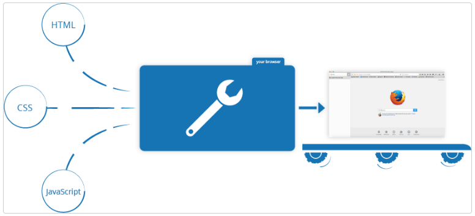

## AULA 9

<br />

- Disciplina: Programação Web
- Professor: Eduardo Malherbi Martins

---

O que é Javascript?

---

#### JavaScript

JavaScript é uma linguagem de programação que permite a você implementar itens complexos em páginas web — toda vez que uma página da web faz mais do que simplesmente mostrar a você informação estática — mostrando conteúdo que se atualiza em um intervalo de tempo, mapas interativos ou gráficos 2D/3D animados, etc. — você pode apostar que o JavaScript provavelmente está envolvido.

---

#### Web

- HTML é a linguagem de marcação que nós usamos para estruturar e dar significado para o nosso conteúdo web. Por exemplo, definindo parágrafos, cabeçalhos, tabelas de conteúdo, ou inserindo imagens e vídeos na página.
- CSS é uma linguagem de regras de estilo que nós usamos para aplicar estilo ao nosso conteúdo HTML. Por exemplo, definindo cores de fundo e fontes, e posicionando nosso conteúdo em múltiplas colunas.
- JavaScript é uma linguagem de programação que permite a você criar conteúdo que se atualiza dinamicamente, controlar múltimídias, imagens animadas, e tudo o mais que há de intessante. Ok, não tudo, mas é maravilhoso o que você pode efetuar com algumas linhas de código JavaScript.

---

#### Exemplo

```js
<p>Informe seu nome:</p>

<script>
const para = document.querySelector('p');

para.addEventListener('click', atualizarNome);

function atualizarNome() {
  var nome = prompt('Insira um novo nome');
  para.textContent = 'Jogador 1: ' + nome;
}
</script>
```

---

#### Então o que ele pode realmente fazer?

- Armazenar conteúdo útil em variáveis.
  - No exemplo, nós pedimos que um novo nome seja inserido e armazenamos o nome em uma variável chamada nome.
- Operações com pedaços de texto (conhecidos como "strings" em programação).
  - No exemplo, nós pegamos a string "Jogador 1: " e concatenamos com a variável nome para criar o texto completo "Jogador 1: Juca Bala".
- Executar o código em resposta a determinados eventos que ocorrem em uma página da Web.
  - Nós usamos o click no nosso exemplo para que quando clicassem no botão, rodasse o código que atualiza o texto.

---

#### Browser APIs

- APIs de navegadores já vem implementadas no navegador, e são capazes de expor dados do ambiente do computador, ou fazer coisas complexas e úteis.

---

#### Browser APIs

- A API DOM (Document Object Model) permite a você manipular HTML e CSS, criando, removendo e mudando HTML, aplicando dinamicamente novos estilos para a sua página, etc. Toda vez que você vê uma janela pop-up aparecer em uma página, ou vê algum novo conteúdo sendo exibido (como nós vimos no exemplo), isso é o DOM em ação.
- A API de Geolocalização recupera informações geográficas. É assim que o Google Maps consegue encontrar sua localização e colocar em um mapa.

---

#### Browser APIs

- As APIs Canvas e WebGL permite a você criar gráficos 2D e 3D animados.
  - [Chrome Experiments](https://experiments.withgoogle.com/search?q=WebGL)
  - [webglsamples](https://webglsamples.org/).
- APIs de áudio e vídeo como HTMLMediaElement (en-US) e WebRTC permitem a você fazer coisas realmente interessantes com multimídia, tanto tocar música e vídeo em uma página da web, como capturar vídeos com a sua câmera e exibir no computador de outra pessoa (veja Snapshot demo para ter uma ideia).

---

#### O que JavaScript está fazendo na sua página web?

- Quando você carrega uma página web no seu navegador, você está executando seu código (o HTML, CSS e JavaScript) dentro de um ambiente de execução (a guia do navegador).
- Isso é como uma fábrica que pega a matéria prima (o código) e transforma em um produto (a página web).

---

#### O que JavaScript está fazendo na sua página web?



---

#### O que JavaScript está fazendo na sua página web?

- Um uso muito comum do JavaScript é modificar dinamicamente HTML e CSS para atualizar uma interface do usuário, por meio da API do DOM.
- Observe que o código em seus documentos web geralmente é carregado e executado na ordem em que aparece na página. Se o JavaScript carregar e tentar executar antes do carregamento do HTML e CSS afetado, poderão ocorrer erros.

---

#### Aula Prática

---

#### Referências

- [Javascript](https://developer.mozilla.org/en-US/docs/Learn/JavaScript/First_steps/What_is_JavaScript)
