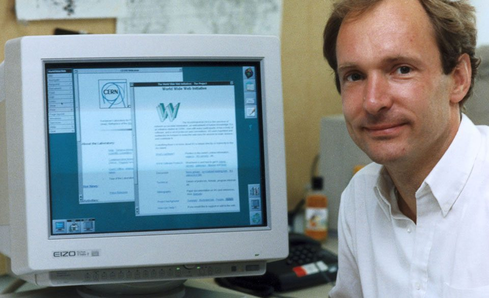

#### A História da Internet

---

#### A História da Internet

- Tim Berners-Lee.
- Criador da World Wide Web (Rede de Alcance Mundial), o famoso WWW.

---

#### A História da Internet

- URLs - Especifica o endereço único e delimita como ela vai ser encontrada pelos usuários.
- Protocolo HTTP - O HTTP é um protocolo de comunicação que assegura a transferência de informações e dados entre redes.
- HTML - O HTML se trata de uma linguagem de marcação que codifica a informação da internet, a fim de que seja exibida de diferentes formas em uma página.

---

#### A História da Internet

- A ideia da World Wide Web era ser um sistema que fosse capaz de tornar mais fácil o compartilhamento de documentos de pesquisas com integrantes da Organização Europeia para a Pesquisa Nuclear (CERN), situada na Suíça.

---

#### A História da Internet

- O primeiro site foi ao ar em 1991;
- Era uma página simples de texto que oferecia uma explicação sobre:
  - O que era a World Wide Web;
  - Como alguém poderia criar um navegador;
  - Configurar um servidor web;
- Em 1994, TIM, fundou o World Wide Web Consortium (W3C) no MIT.

[Primeiro Site da História](http://info.cern.ch/hypertext/WWW/TheProject.html)

---

#### Referências

- [O que significa WWW?](https://canaltech.com.br/produtos/o-que-significa-www/)
- [Primeiro Site da História](http://info.cern.ch/hypertext/WWW/TheProject.html)

#### [VOLTAR](../)
